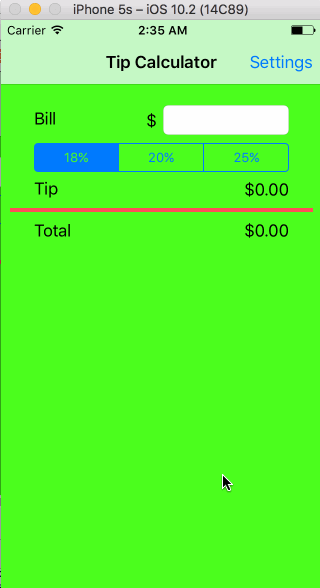
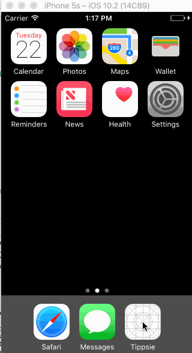

# TipCalculator

This is a Tip Calculator application for iOS submitted as the pre-assignment requirement for Codepath.

Time spent: 4 hours

Completed:

## Required features
* [x] User can enter a bill amount, choose a tip percentage, and see the tip and total values.
* [x] Settings page to change the default tip percentage.

## Optional features
* [x] Auto-apply the default tip percentage when changed
* [x] Remembering the bill amount across app restarts
* [x] Using locale-specific currency
* [ ] Switch thousands separators based on selected currency
* [ ] UI animations
* [ ] Ignore the remembered bill amount after 10 minutes

## Additional features
* [x] Remembering the tip percentage across app restarts.
* [ ] Making sure the keyboard is always visible and the bill amount is always the first responder.
* [ ] Theming the Settings page like the main application page.
* [ ] Support orientation change and make it compatible on other screens.

# Video Walkthrough

## Basic User Stories

## Additional User Stories

GIF courtesy: [LiceCap](http://www.cockos.com/licecap/).
