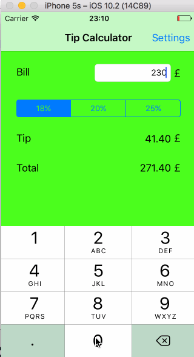

# Pre-work: TipCalculator

This is a Tip Calculator application for iOS submitted as the pre-assignment requirement for Codepath.

Submitted by: Ravi Kumar Mandala

Time spent: 8 hours in total

## User Stories

### Required features
* [x] User can enter a bill amount, choose a tip percentage, and see the tip and total values.
* [x] Settings page to change the default tip percentage.

### Optional features
* [x] Auto-apply the default tip percentage when changed
* [x] Remembering the bill amount across app restarts (< 5 minutes)
* [x] Using locale-specific currency
* [ ] Switch thousands separators based on selected currency
* [ ] UI animations

### Additional features
* [x] Remembering the tip percentage across app restarts.
* [x] Added an option to round up/down the total amount. 
* [x] Added a decimal keypad 
* [x] Making sure the keyboard is always visible and the bill amount is always the first responder.
* [x] Theming the Settings page like the main application page (applied colors).
* [ ] Support orientation change and make it compatible on other screens.

## Project Analysis

As part of your pre-work submission, please reflect on the app and answer the following questions below:

* **Question:** What are your reactions to the iOS app development platform so far? How would you describe outlets and actions to another developer?
* **Answer:** Impressed by how little code is needed for Hello World application. Swift is significantly better than Objective C. Outlets are handles for the UI elements, for programmatic control. Actions are code snippets to be executed when certain UI event happens.

* **Question:** Any idea how they are being implemented under the hood?
* **Answer:** XCode is generating xml under the hood just like Android IDEs do, which is named as a .lproj file.

* **Question:** Swift uses [Automatic Reference Counting](https://developer.apple.com/library/content/documentation/Swift/Conceptual/Swift_Programming_Language/AutomaticReferenceCounting.html#//apple_ref/doc/uid/TP40014097-CH20-ID49) (ARC), which is not a garbage collector, to manage memory. Can you explain how you can get a strong reference cycle for closures?
* **Answer:** If class A has a strong reference to an object of type Class B and Class B has a reference to an object of type Class A, then a string reference cycle would be created. This can be prevented by using weak references.

## Video Walkthrough

## Basic User Stories

## Additional User Stories

GIF courtesy: [LiceCap](http://www.cockos.com/licecap/).

## License

Copyright [2017] [Ravi Kumar Mandala]

Licensed under the Apache License, Version 2.0 (the "License");
you may not use this file except in compliance with the License.
You may obtain a copy of the License at

http://www.apache.org/licenses/LICENSE-2.0

Unless required by applicable law or agreed to in writing, software
distributed under the License is distributed on an "AS IS" BASIS,
WITHOUT WARRANTIES OR CONDITIONS OF ANY KIND, either express or implied.
See the License for the specific language governing permissions and
limitations under the License.
